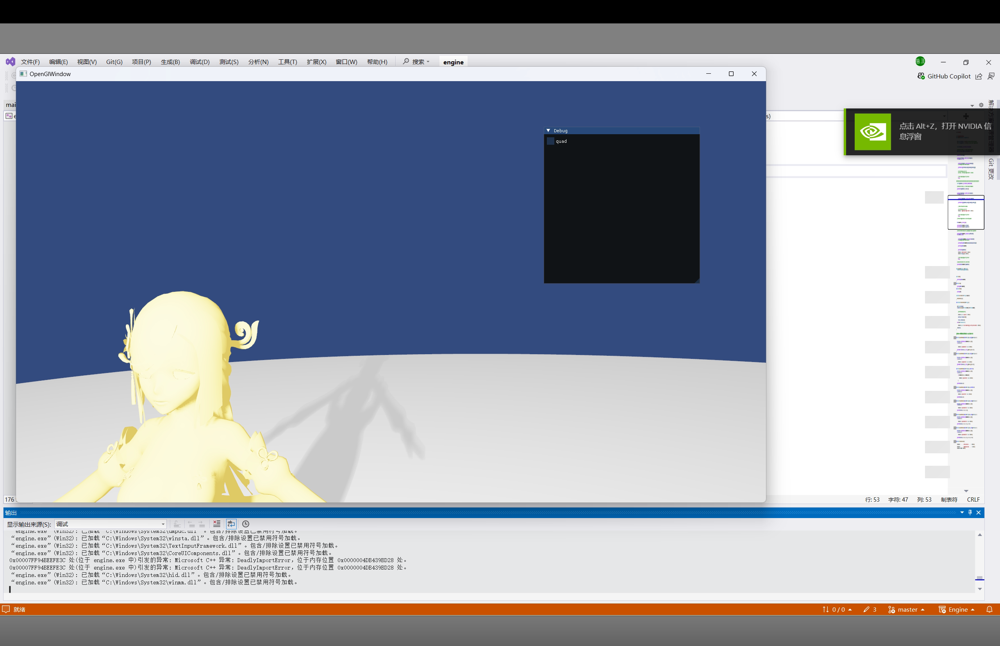
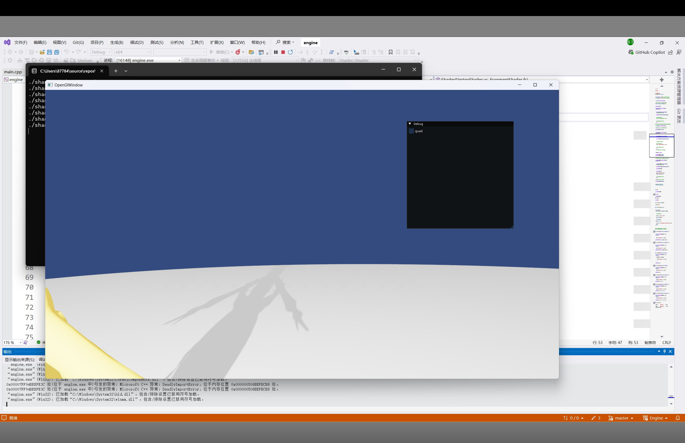
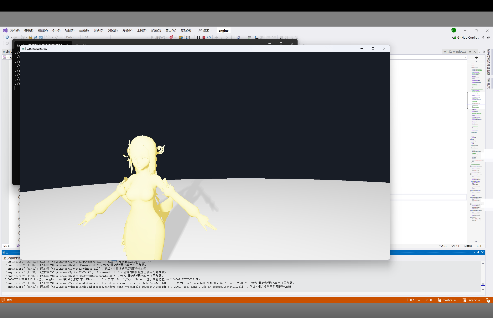
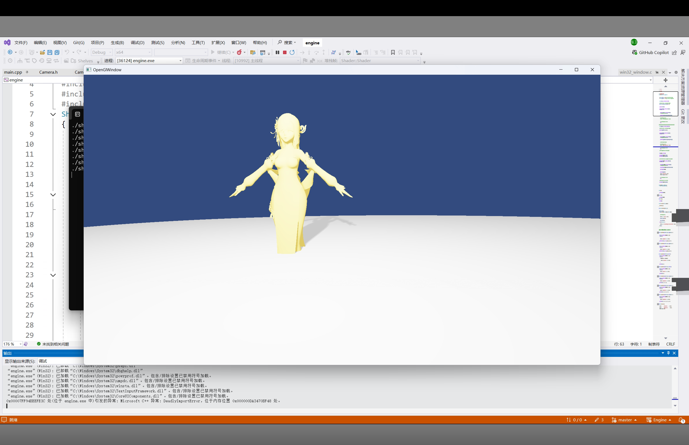
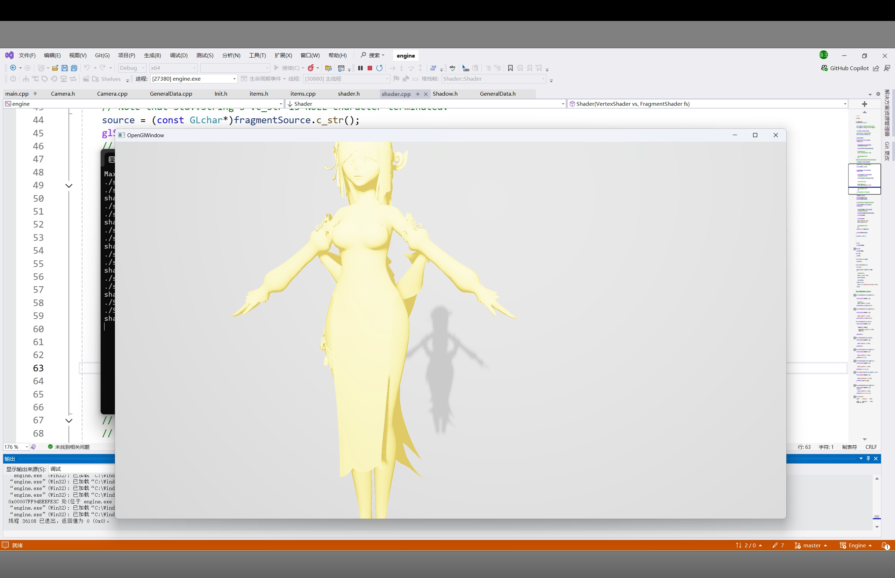
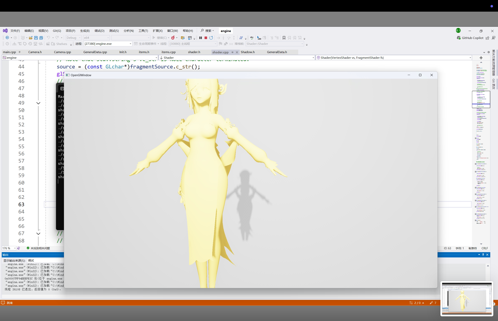
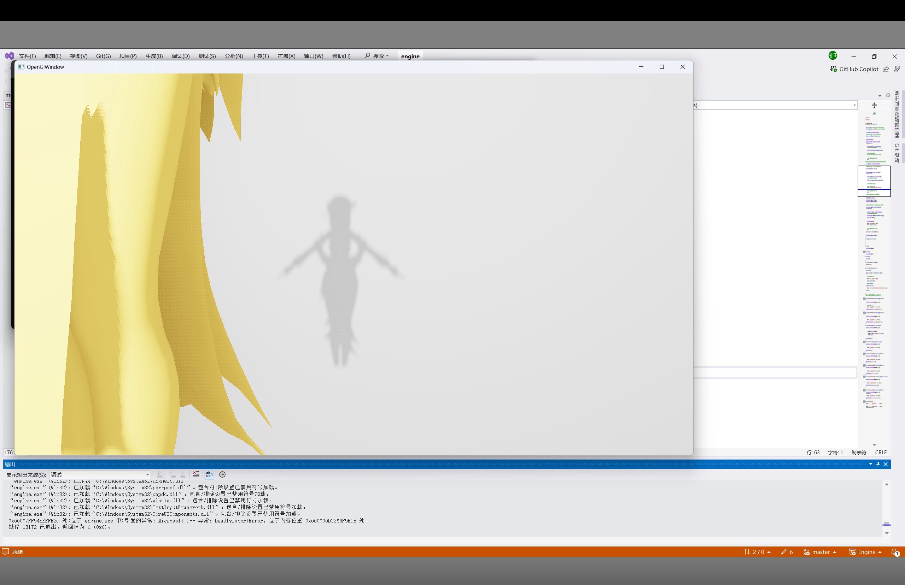
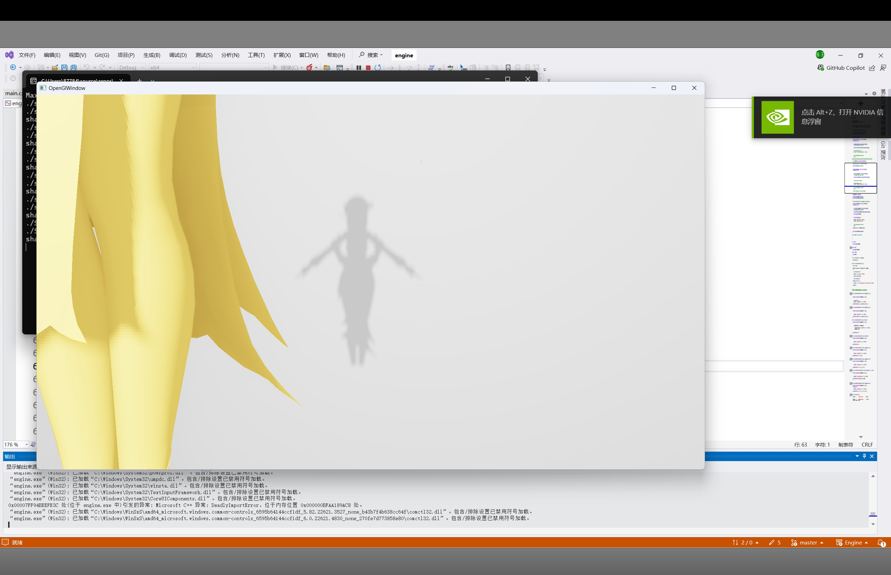

# 计划

- [x] 一个box的类
- [x] 实现一个Sphere的类 
- [x] 实现球的PBR
- [x] 导入ImGUI实现有UI控制的球的PBR
- [x] Shadow Map PCF PCSS
- [x] 实现defered shading
- [ ] 带IBL的PBR
- [ ] SSAO
- [ ] FXAA

# 结构


# FunctionLayer

## gameObject和component

按照piccolo的做法和教程中的做法，可以想到的一点是，保证component的派生类一定使用默认的构造函数。

#### MeshComponent

用来渲染的组件。

调用ResourceLayer中的Model来加载和渲染。


#### 相机

调用glfw的接口实现了鼠标控制镜头方向，键盘控制相机位置的功能。一个典型的FPS的摄像头的效果。

## 阴影

我们知道，实际上shadwo map本身和场景是怎么样的关系不大，shadow map需要的是光源的位置，我们在一个和屏幕相同大小的depth buffer上记录从光源出发看到的最浅深度，并把它作为一个attachment放在一个framebuffer object上。

这是可以单独抽象出来作为一个类的。

### PCF&PCSS

我们可以明显的看到，相对于pcf，pcss在袖口处有比较明显的软阴影效果。

pcss



pcf


# ResourceLayer

## Model

理想情况下肯定是直接对model调用draw操作就可以让它在屏幕上画出来。

使用Assimp来加载模型。

Assimp默认使用OpenGL的右手系。

+X向右，+Y向上，+Z指向屏幕外面。

UV坐标中，原点在左下角，在read file时可以使用aiProcess_FlipUVs flag来把坐标系的原点放到左上角。


### Mesh

Assimp中的Mesh存储在一个数组中。一个aiMesh由一系列的数据组成，其中保证存在的只有mVertices和mFaces.

所有的mesh实体保存在Scene的mesh中，而所有的node中的mMeshes数组仅仅只保留对应的mesh在Scene的Mesh中的index。

在代码中构造一个类来对应这个aiMesh.

在read file的时候通过指定flag也可以计算出其中的一些值。

#### Vertex

mesh中的值存储在vertex类中，包含位置、法线、纹理坐标等。

### Texture

## shader

对shader的一个优化：如果shader上传失败的话，会不停的重新尝试，打印非常多次的upload失败，我们加上一个变量控制这个问题。

# 延迟着色



将管线调整为延迟渲染后得到的结果。

我们能看到相比于原来的效果不同的地方是背景暗了。

背景变暗是因为我们最后使用了一个quad来覆盖整个屏幕，这个时候屏幕上所有的颜色都取决于这个quad，当我们在shader中加上这样的判断：

```glsl
// 检查深度值是否为背景（例如深度值 1.0）
float depth = texture(gDepth, TexCoords).r;
if (depth == 1.0) {
    // 直接使用清除颜色或跳过光照计算
    FragColor = vec4(clearColor, 1.0);
    return;
}
```

我们就能得到这样的结果：



使用数码测色器测量两个蓝色是一样的。

## 延迟渲染与阴影

实际上我们还是执行和正向着色的shadow map一样的算法，我们首先还是执行shadow mapping 的pass，记录在一个texture，这个texure会在最后渲染quad的时候使用。

因为G-Buffer记录了世界坐标，我们只需要在最后渲染quad的时候添加一个light space matrix就可以了。

# SSAO

shadow+PBR 不使用SSAO：



使用SSAO：



这里为了使SSAO的效果更加明显，将采样的半径设置为了10。

我们可以看到，此时在几何体较为接近的位置，亮度变暗了。同时影子也变暗了。

随着采样半球的半径增大，每个fragment会记录更多几何之间的遮蔽关系，那么在这个模型的的几何关系下，ssao会更加明显。

这是因为此时我们并没有调整环境光的系数，还是使用的0.03作为环境光系数。

## blur

当我们使用ssao而此时ssao中并未实现blur效果：



当我们添加在ssao的遮蔽因子计算之后添加blur：



我们可以看到此时就不再有明显的噪声纹理。


# 碰到的问题

开启深度测试之后没有清理 GL_DEPTH_BUFFER_BIT,导致画面上只有clear-color 的颜色。

如果不清理GL_Color_BUffer_BIt, 那么屏幕就会一直保持第一帧的颜色，如果不清理GL_Depth_Bit,那么物体就会无法显示。

它们就是默认的framebuffer的attachment。

## PBR中NormalDistributionFunction中GGX的粗糙度参数问题

公式给出的$\alpha$应该就是粗糙度本身，但是由于迪士尼principle的建议，最好是将$\alpha$设置为$roughness$的平方，这样在$[0,1]$内可以获得更线性的表现。

## Assimp对FBX类型的文件的支持不到位

现在可以确定的是，assimp没有只加载了diffuse的纹理，其他的都没有加载。

纹理加载问题对于不同格式的模型差距比较大，能够稳定加载的是glb，assimp对fbx的支持不是很到位。


模型的颜色不对主要还是纹理对应的绑定有问题，不能在for循环中执行shader.UpLoadUniformInt("aoMap", ao.texture_id);这样的操作。

## 相机

这里有一个问题就是不能做相机的平移的时候需要考虑glm::lookAt函数的参数定义。

参数是（位置，目标位置，up），我们更新摄像机位置的之后，需要重新计算view矩阵，这个时候需要写成这样的形式：
glm::lookAt(pos,front+pos,up),我们的想法是实现按a和d的时候实现平移，这个时候我们应该就需要让目标位置和相机位置保持front的方向不变，如果我们只写glm::lookAt(pos,front,up),因为这里代表的不是front方向而是目标位置，就会导致我们的相机造成一个旋转的效果。

## model矩阵的顺序问题

先缩放还是先平移？

**先缩放再平移**

如果你先进行缩放变换，然后再进行平移变换，结果是对象会先被缩放，然后再被平移到新的位置。==缩放变换不会影响平移的结果==。

**先平移再缩放**

如果你先进行平移变换，然后再进行缩放变换，结果是对象会先被平移到新的位置，然后再以新的位置为中心进行缩放。==平移变换会影响缩放的结果==。

## uniform的优化问题

在shadow map中，给shadwo map写了一个非常简单的vertex shader，这个时候，因为我们的vertex shader do nothing，这个uniform 被优化掉了。

实际上我使用了这些uniform，但是我的问题是，shader里面我加了一个新的直接从路径生成shader的构造函数，这个构造函数有问题。

## 软阴影的效果问题

同样的代码，当我使用一个球（无论是正球还是椭球），很难看到软阴影，当我换成人物模型的时候，我们可以看到在手臂处有比较明显的软阴影效果。

这是因为：物体的形状的复杂程度决定了阴影边缘的平滑程度，更加平滑的阴影边缘会导致软阴影效果不明显。

在软阴影区域，进行了blocker search $d_{blocker}=\sum depth/blockerNumber$

对于一个球的阴影，我们可以假设得到的$d_{blocker}$是相同的，因为它的几何分布是非常均匀的。

而对于一个复杂的物体，它的$d_{blocker}$差距会比较大，我们知道，计算半影的面积公式为：$w_{Penumbra}=\frac{d_{Receiver}-d_{Blocker}}{d_{blocker}}\cdot w_{light}$,此时，半影的范围差距就会比较大，这就导致了在PCF是的范围差距比较大，从而导致阴影的颜色会有比较明显的差距。

## HDR的纹理支持问题

在延迟着色中，需要纹理来存储albedo，当albedo的取值超过1的时候我们需要切换纹理数据的存储格式来保证HDR颜色的正常显示，否则颜色会在1截断，导致显示的效果不好。

我们应当使用

```cpp
	glTexImage2D(GL_TEXTURE_2D, 0, GL_RGBA16F, GeneralData::width, GeneralData::height, 
		0, GL_RGBA, GL_FLOAT, NULL);
```

来存储。如果我们使用GL—RGBA和GL—UNSIGNED来存储，数值会在1截断。

## SSAO

1. uniform 被优化，哪怕我们使用一个texture，但是只采样而没有使用，这个uniform还是会被优化掉。
2. ssao效果不明显。 当radius设置为1的时候我们很难看出ssao的效果。

```glsl
float depthValue= texture(texture3, offset.xy).w;//??????? 为什么取负号？
```

这里不应该取负号。

分析：应该从如何存储z值开始考虑。

这里LearnOpenGL取了负号，但是OpenGL取负号的做法和我的不同，所以这里不能一概而论。

我在GBuffer中存储的是世界坐标以及view space的线性深度值，而LearnOpenGL存储的是view space的坐标以及一个深度值。（这个深度值中文版和原版的处理不同，就都记为深度值）。之后的PBR流程需要的是世界坐标的值，所以我们在ssao的纹理处理部分加入一个view 矩阵来把世界坐标转化为view space的坐标。texture3存储的是我们之前记录的view space的坐标，经过renderdoc的验证也没有问题。那么在同一坐标系下的比较我们并不需要取负号。所以我们这里就不取负号了。

